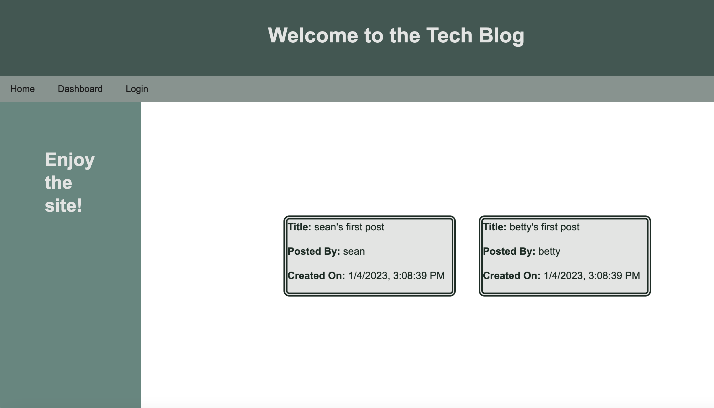

# tech-blog-mvc
Module 14 Challenge - Model-View-Controller (MVC): Tech Blog

## Description

**User Story**
AS A developer who writes about tech
I WANT a CMS-style blog site
SO THAT I can publish articles, blog posts, and my thoughts and opinions

This project follows the MVC paradigm in its architectural structure, using *Handlebars.js* as the templating language to deliver HTML pages to a client browser, *Sequelize* as the ORM, and the *express-session* npm package for authentication. It enables users to interact with a server-side relational database (MySQL) through *npm express* routes to create, update and view  blog posts, and submit comments to other blog posts.

## Table of Contents (Optional)

If your README is long, add a table of contents to make it easy for users to find what they need.

- [Installation](#installation)
- [Usage](#usage)
- [License](#license)

## Installation

- Clone the repo to a local machine with Node JS and MySQL installed
- Run `npm install` to install required packages
- Run the `./db/schema.sql` script to create the database.
- Run `npm run seed` to populate the database with basic data 
- Run `npm start` to start a listening Node instance.

## Usage

Provide instructions and examples for use. Include screenshots as needed.

- Browse to `http://localhost:3001` to access the main page
- Create a new user account
- Use the links and forms to create and manage blog posts and comments.

    

## License

[MIT License](LICENSE)

